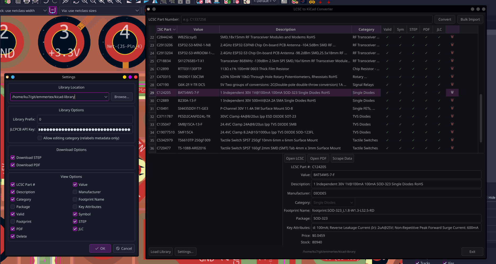
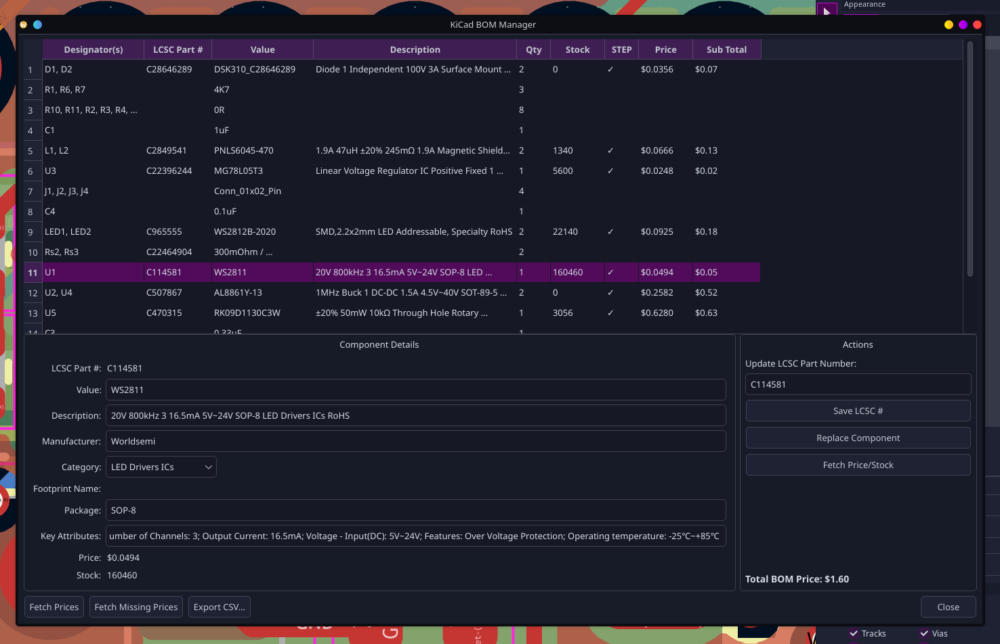

# KiCad Component Manager

A KiCad Library Manager and BOM Manager that downloads and manages LCSC components for your KiCad projects.

---

## Features

### Library Manager



- Enter an LCSC part number and press **Enter** or **Import** — the part is queued immediately
- Bulk Import — paste a list of part numbers or load them from a file
- Command-line import — import parts straight from the terminal (see below)
- Curated categories — parts are sorted into a fixed set of ~32 KiCAD symbol libraries; any LCSC category is mapped to the closest match (with an `Uncategorized` fallback)
  - All libraries and the `sym-lib-table` are created up front, so KiCAD doesn't need a restart when a part lands in a new category
  - The original LCSC category is still kept on the symbol for granular searching
- Live status table shows each download step as it progresses
- Detects parts already present in the library to avoid re-downloading
- Retry any failed step individually by clicking its cell
- Load an existing KiCad library to inspect and manage parts already in it
- Delete a part from the library (symbol, footprint, STEP, and PDF) with one click
- PDF size check — files under 10 KB (LCSC "not available" placeholders) are rejected automatically
- When PDF is disabled or unavailable, the LCSC product URL is stored in the PDF cell
- Recent library locations remembered in a dropdown
- Available as a KiCad Action Plugin (Tools → External Plugins)

### BOM Manager



> **Note:** The BOM Manager must be launched from within KiCad and requires the plugin to be installed.

- Reads all components from the open PCB and displays them grouped by part, with designators, values, descriptions, and quantities
- Instantly highlights parts missing an LCSC part number or a 3D STEP model
- Fetch latest pricing and stock levels from JLCPCB for all parts, or only for parts not yet priced
- Shows a running total BOM price
- Assign an LCSC part number to any ungrouped part directly from the table
- Replace a component in the library with a freshly downloaded version (full symbol, footprint, and 3D model)
- Export the complete BOM to a CSV file

---

**Status icons**

| Icon | Meaning |
|---|---|
| ○ | Not yet started |
| ⟳ | In progress |
| ✓ | Done |
| ✗ | Failed — click to retry |
| — | Skipped (option disabled) |

Clicking any **○ or ✗** cell retries only that step.  
Clicking a row shows the download log for that part in the panel below the table.

---

## Importing into KiCad

- **Symbols:** Preferences → Manage Symbol Libraries → add Table `sym-lib-table`
- **Footprints:** Preferences → Manage Footprint Libraries → add the `footprint.pretty` folder
- **3D models:** Linked automatically inside the footprint; keep `footprint/` and `footprint.pretty/` in the same parent directory

---

## Installation

### Standalone (no KiCad integration)

**BOM Manager will not work** without KiCad integration.

```bash
git clone https://github.com/emmertex/kicad-component-manager
cd kicad-component-manager
./run.sh
```

On Windows (without WSL):

```bash
python -m venv venv
venv\Scripts\activate
pip install -r requirements.txt
python manager.py
```

---

## KiCad Plugin Installation (Reccomended)

### Option 1 — Install from File (Recommended for most users (for now))

The PCM zip is self-contained: it bundles the application and the full backend.
Python dependencies (PySide6, requests, etc.) are handled automatically on first use.

1. Download the latest PCB from Releases: [Download](https://github.com/emmertex/kicad-component-manager/releases)
2. In KiCad: **Plugin and Content Manager → Install from File** → select the zip. and install.
3. Click **KiCad Component Manager** or **BOM Manager** in the toolbar or via **Tools → External Plugins**.
   - If PySide6 is already installed system-wide, the GUI launches immediately.
   - If not, a one-time setup dialog offers to create a local venv and install all
     dependencies automatically (~1–2 minutes). After that, subsequent launches are instant.


### Option 2 — Symlink install (recommended for repo users on Linux only)

```bash
git clone https://github.com/emmertex/kicad-component-manager
cd kicad-component-manager
./run.sh            # set up venv and dependencies
./install_plugin.sh # symlink kicad_plugin/ into KiCad's scripting/plugins/
```

Restart KiCad
The plugin appears under **Tools → External Plugins**.

To uninstall, delete the symlink:

```bash
rm ~/.local/share/kicad/10.0/scripting/plugins/lcsc2kicad
```

---

## Credits

Built upon:

- [JLC2KiCad_lib](https://github.com/TousstNicolas/JLC2KiCad_lib) by TousstNicolas — core symbol/footprint/3D model conversion (MIT)
- [lcsc2kicad](https://github.com/DasBasti/lcsc2kicad) by DasBasti — LCSC component handling approach (MIT)
- [lcsc2kicad-GUI](https://github.com/milutintech/lcsc2kicad-GUI) by milutintech — original GUI foundation (MIT)


## Changelog

See [CHANGELOG.md](changelog.md) for an overview of release notes.

---

## License

MIT
