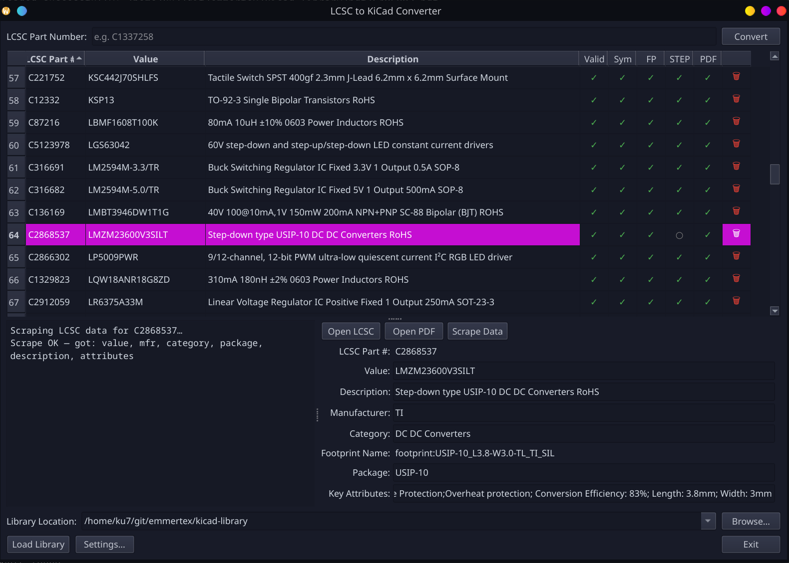

# KiCad Component Manager

A GUI for downloading and managing LCSC components in your KiCAD Library.  



---

## Features

- Enter an LCSC part number and press **Enter** or **Convert** — the part is queued immediately
- Bulk Import — paste a list of part numbers or load them from a file
- Command-line import — import parts straight from the terminal (see below)
- Curated categories — parts are sorted into a fixed set of ~32 KiCAD symbol libraries; any LCSC category is mapped to the closest match (with an `Uncategorized` fallback)
  - All libraries and the `sym-lib-table` are created up front, so KiCAD doesn't need a restart when a part lands in a new category
  - The original LCSC category is still kept on the symbol for granular searching
- Live status table shows each download step as it progresses
- Detects parts already present in the library to avoid re-downloading
- Retry any failed step individually by clicking its cell
- Load an existing KiCad library to inspect and manage parts already in it
- Delete a part from the library (symbol, footprint, STEP, and PDF) with one click
- PDF size check — files under 10 KB (LCSC "not available" placeholders) are rejected automatically
- When PDF is disabled or unavailable, the LCSC product URL is stored in the PDF cell
- Recent library locations remembered in a dropdown
- Available as a KiCad Action Plugin (Tools → External Plugins)

---

**Status icons**

| Icon | Meaning |
|---|---|
| ○ | Not yet started |
| ⟳ | In progress |
| ✓ | Done |
| ✗ | Failed — click to retry |
| — | Skipped (option disabled) |

Clicking any **○ or ✗** cell retries only that step.  
Clicking a row shows the download log for that part in the panel below the table.

---

## Output Library Structure

```
your-library/
├── footprint.pretty/
│   └── ComponentName.kicad_mod
├── footprint/
│   └── packages3d/
│       └── ComponentName.step
├── symbol/
│   └── components.kicad_sym
└── pdf/
    └── C123456.pdf
```

---

## Importing into KiCad

- **Symbols:** Preferences → Manage Symbol Libraries → add `symbol/components.kicad_sym`
- **Footprints:** Preferences → Manage Footprint Libraries → add the `footprint.pretty` folder
- **3D models:** Linked automatically inside the footprint; keep `footprint/` and `footprint.pretty/` in the same parent directory

---

## Installation

### Standalone (no KiCad integration)

```bash
git clone https://github.com/emmertex/kicad-component-manager
cd kicad-component-manager
./run.sh          # creates venv, installs deps, launches manager.py
```

On Windows (without WSL):

```bash
python -m venv venv
venv\Scripts\activate
pip install -r requirements.txt
python manager.py
```

---

## KiCad Plugin Installation

The plugin registers an action under **Tools → External Plugins → KiCad Component Manager**.  
It launches `manager.py` as a separate process using the repo's `venv` Python, so KiCad's own Python environment needs no extra packages.

### Option 1 — Symlink install (recommended for repo users)

```bash
git clone https://github.com/emmertex/kicad-component-manager
cd kicad-component-manager
./run.sh            # set up venv and dependencies
./install_plugin.sh # symlink kicad_plugin/ into KiCad's scripting/plugins/
```

Restart KiCad (or run **Tools → Scripting Console** and type `import pcbnew; pcbnew.LoadPlugins()`).  
The plugin appears under **Tools → External Plugins**.

To uninstall, delete the symlink:

```bash
rm ~/.local/share/kicad/10.0/scripting/plugins/lcsc2kicad
```

### Option 2 — Install from File (PCM zip)

The PCM zip is self-contained: it bundles `manager.py` and the full backend.
Python dependencies (PySide6, requests, etc.) are handled automatically on first use.

1. Download or build the PCM zip:
   ```bash
   ./build_pcm.sh 1.0.1
   ```
2. In KiCad: **Plugin and Content Manager → Install from File** → select the zip.
3. Restart KiCad.
4. Click **KiCad Component Manager** in the toolbar or via **Tools → External Plugins**.
   - If PySide6 is already installed system-wide, the GUI launches immediately.
   - If not, a one-time setup dialog offers to create a local venv and install all
     dependencies automatically (~1–2 minutes). After that, subsequent launches are instant.

---

## Credits

Built upon:

- [JLC2KiCad_lib](https://github.com/TousstNicolas/JLC2KiCad_lib) by TousstNicolas — core symbol/footprint/3D model conversion (MIT)
- [lcsc2kicad](https://github.com/DasBasti/lcsc2kicad) by DasBasti — LCSC component handling approach (MIT)
- [lcsc2kicad-GUI](https://github.com/milutintech/lcsc2kicad-GUI) by milutintech — original GUI foundation (MIT)


## Changelog

See [CHANGELOG.md](changelog.md) for brief overview of releases.

---

## License

MIT
